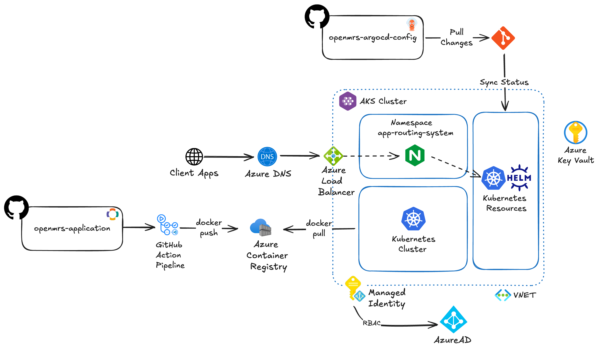
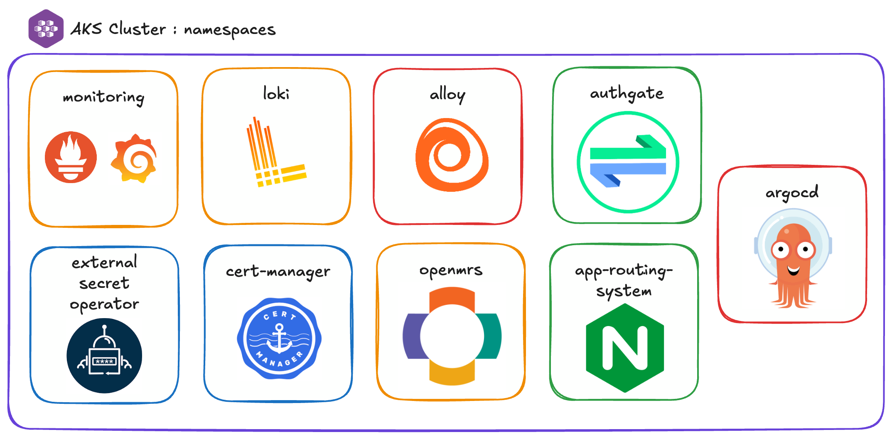
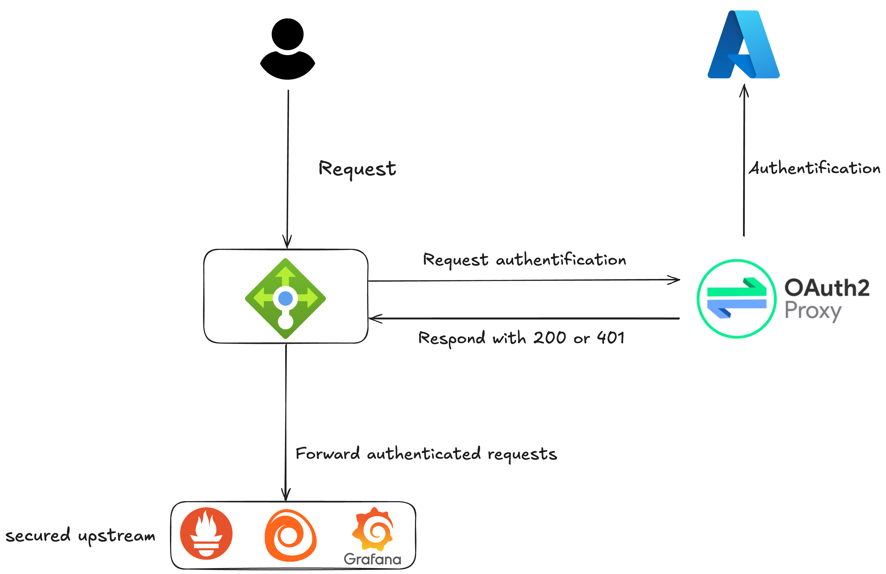
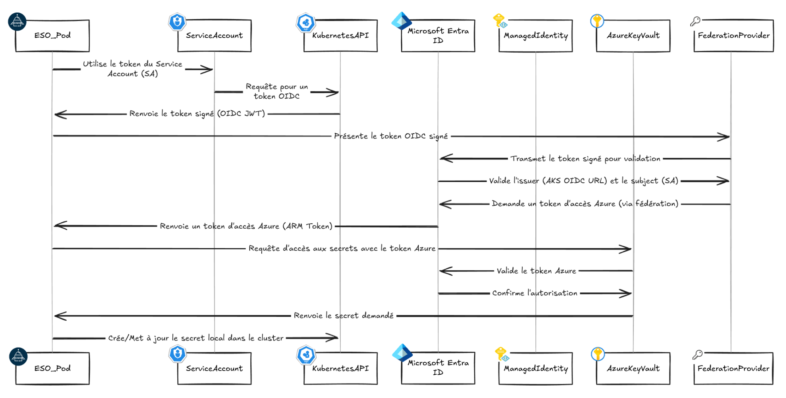
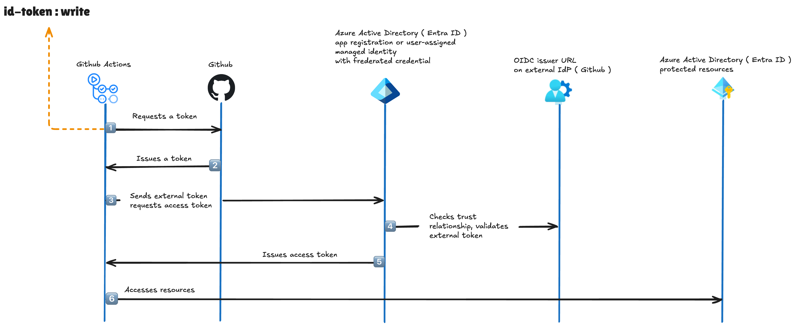

# Introduction

## Objectif du document

Ce document d’architecture technique a pour objectif de présenter, de manière détaillée et structurée, l’architecture de la plateforme AudioProthese+. Il s’adresse principalement aux architectes, développeurs, administrateurs système et toute personne impliquée dans la conception, le déploiement et l’exploitation du système d’information.

## Contexte

AudioProthèse+ est un réseau de centres d'audioprothèse implanté dans plusieurs villes en France, offrant des services de diagnostic, d'appareillage et de suivi pour les personnes souffrant de troubles auditifs.

Avec une présence dans plus de 50 villes et un siège social à Paris, l'entreprise gère des données sensibles de patients et utilise des équipements médicaux de pointe connectés.

Face à l'augmentation des cybermenaces dans le secteur de la santé et à la nécessité de se conformer aux réglementations strictes en matière de protection des données médicales, AudioProthèse+ a décidé de renforcer significativement sa sécurité informatique.

Pour se faire, l'entreprise souhaite mettre en place et déployer des solutions d’automatisation, de résilience et d’observabilité afin d’améliorer la fiabilité de son infrastructure. Ce projet ambitieux vise à concevoir et déployer l'infrastructure nécessaire de manière automatisée, en utilisant des pratiques DevOps et des solutions open source. L'objectif est de créer une infrastructure flexible, évolutive et économiquement efficace, tout en garantissant un niveau de sécurité optimal pour protéger les données des patients et l'intégrité des systèmes d'AudioProthèse+.

## Portée du document

Ce document couvre l’ensemble des aspects techniques de la plateforme, notamment :

- L’architecture globale du système
- Les choix technologiques (Kubernetes, microservices, CI/CD, etc.)
- Les composants principaux et leurs interactions
- Les principes de sécurité et de haute disponibilité
- Les stratégies de déploiement et de supervision

Il ne s'agira pas ici de détailler les aspects fonctionnels de la plateforme, qui sont eux détaillés dans un [wiki dédié](https://audioprothese.github.io/openmrs-architecture-documentation/). Ce document se concentre sur l'architecture technique et les choix technologiques qui sous-tendent la mise en œuvre de la plateforme AudioProthèse+.

## Public visé

Ce document s’adresse aux :

- Architectes techniques
- Développeurs
- Ingénieurs DevOps
- Administrateurs système
- Responsables de la sécurité informatique

## Répartition des rôles et responsabilités

**Matteo ZINUTTI**  
*Rôle : Ingénieur DevOps*  
Responsabilités :  

- Mise en œuvre des stacks d'observabilité Open-Source (Grafana, Prometheus, Loki)  
- Synchronisation des secrets Azure

---

**Fabien CHEVALIER**  
*Rôle : Ingénieur DevOps*  
Responsabilités :  

- Mise en place de l'industrialisation de la plateforme (Terraform, Helm, ArgoCD)  
- Gestion des déploiements CI/CD  
- Mise en place de la documentation as code

---

**Hakim AFARMACH**  
*Rôle : Ingénieur DevOps*  
Responsabilités :  

- Mise en place des solutions de sécurité (Oath2, Zero-trust)  
- Mise en place des configurations Kubernetes

---

### Méthodologie de travail

Mise en place de feature branches pour chaque fonctionnalité ou correctif, avec des pull requests pour la revue de code. Organisation de sprints de développement de deux semaines, avec des réunions quotidiennes pour le suivi de l'avancement et la résolution des blocages. Utilisation d'outils de gestion de projet inclus à GitHub pour le suivi des tâches et des bugs.

Le plateforme à été développée en collaboration constante, avec une spécialité pour chaque membre de l'équipe. Les rôles ont été répartis en fonction des compétences et des intérêts de chacun, et sont détaillés ci-dessus.

Un soin important à été apporté à la documentation, tant au niveau du code source (commentaires, README) qu'au niveau de la documentation technique (ce document). La documentation est considérée comme un élément essentiel pour assurer la maintenabilité et la compréhension de l'architecture par les futurs intervenants. Il a d'ailleurs été décidé de mettre en place une documentation as code, permettant de versionner la documentation avec le code source et de la maintenir à jour de manière cohérente. Cette documentation est hébergée sur GitHub et accessible aux membres de l'équipe ainsi qu'aux parties prenantes du projet.

## Présentation des outils et solutions techniques

Dans le cadre de l’industrialisation et de la supervision de la plateforme AudioProthèse+, plusieurs outils et services ont été sélectionnés afin de garantir la sécurité, la fiabilité et la scalabilité de l’infrastructure. Le choix de ces solutions s’inscrit dans une démarche DevOps et repose sur des technologies open source et des services cloud éprouvés.

Cette section présente les outils et solutions retenus, ainsi que leurs rôles respectifs dans l’architecture technique de la plateforme. Le détail des configurations et leur justification seront abordés dans les sections suivantes.

### Azure Cloud

Azure est la plateforme cloud choisie pour héberger l’ensemble de l’infrastructure d’AudioProthèse+. Azure offre une large gamme de services cloud, notamment des machines virtuelles, des bases de données, des services de stockage et des outils de gestion et de sécurité. L’utilisation d’Azure permet à AudioProthèse+ de bénéficier d’une infrastructure scalable, résiliente et sécurisée, tout en réduisant les coûts d’exploitation.

### Kubernetes via AKS

Kubernetes est utilisé comme orchestrateur de conteneurs pour le déploiement et la gestion de l’application OpenMRS. Il permet d’automatiser la mise à l’échelle, la résilience et la maintenance des services applicatifs, tout en offrant une grande flexibilité dans la gestion des ressources. Nous utilisons AKS (Azure Kubernetes Service) pour bénéficier d’une solution managée, simplifiant ainsi la gestion de l’infrastructure sous-jacente.

Le cluster Kubernetes hébergera :

- Les microservices de l’application OpenMRS (frontend/backend et gateway)
- Les bases de données (MariaDB)
- Les services de supervision et de sécurité (Prometheus, Grafana, Loki)
- Les outils de déploiement continu (ArgoCD)

### GitHub et GitHub Actions

GitHub est utilisé comme plateforme de gestion de code source et de collaboration pour l’équipe de développement. Les dépôts GitHub contiennent le code source des microservices, ainsi que les fichiers de configuration nécessaires au déploiement sur Kubernetes.

GitHub Actions est utilisé pour automatiser les processus de CI/CD (Intégration Continue / Déploiement Continu). Il permet de construire, tester et déployer automatiquement les applications à chaque modification du code source. Les workflows GitHub Actions sont configurés pour interagir avec le cluster Kubernetes et déployer les nouvelles versions des microservices.

### Industrialisation et outils DevOps

L’industrialisation de la plateforme repose sur plusieurs outils et pratiques DevOps, notamment :

- **Terraform** : utilisé pour la gestion de l’infrastructure en tant que code (IaC). Terraform permet de définir et de provisionner l’infrastructure Azure de manière automatisée et reproductible.
- **Helm** : utilisé pour la gestion des packages Kubernetes. Helm permet de simplifier le déploiement et la gestion des applications sur Kubernetes en utilisant des charts, qui sont des ensembles de fichiers de configuration.
- **ArgoCD** : utilisé pour la gestion des déploiements Kubernetes. ArgoCD permet de synchroniser l’état de l’application avec le code source, garantissant ainsi que les déploiements sont toujours à jour et conformes aux spécifications.
- **Prometheus** : utilisé pour la collecte et la surveillance des métriques des applications et de l’infrastructure. Prometheus permet de suivre les performances et la santé des services déployés sur Kubernetes.
- **Grafana** : utilisé pour la visualisation des métriques collectées par Prometheus. Grafana permet de créer des tableaux de bord personnalisés pour surveiller l’état de l’infrastructure et des applications.
- **Loki** : utilisé pour la collecte et l’analyse des logs des applications et de l’infrastructure. Loki permet de centraliser les logs et de faciliter leur recherche et leur analyse.
- **SonarQube** : utilisé pour l’analyse statique du code source. SonarQube permet de détecter les problèmes de qualité du code, les vulnérabilités et les problèmes de sécurité.

# Architecture technique

Cette section présente sous forme schématique l’architecture technique de la plateforme AudioProthèse+. Elle illustre les différents composants de l’infrastructure, leurs interactions et les flux de données entre eux.

## Diagramme d'architecture globale (Azure/Kubernetes)



### Répartition des namespaces



La répartition des namespaces Kubernetes est organisée de manière à isoler les différents environnements et services de la plateforme. Chaque namespace correspond à un environnement spécifique (développement, test, production) ou à un service particulier (frontend, backend, gateway). Dans notre cas, nous avons organisé les namespaces par service, l'environnement de production étant hébergé sur un cluster AKS dédié. Les namespaces sont les suivants :

- **monitoring** : pour les services de supervision (Prometheus, Grafana)
- **loki** : pour le service de collecte et d'analyse des logs (Loki)
- **alloy** : pour le service Alloy, permettant de scrapper les métriques OpenMRS
- **openmrs** : pour les services OpenMRS (frontend, backend, gateway)
- **external-secret-operator** : pour le service de synchronisation des secrets Azure
- **argocd** : pour le service de gestion des déploiements (ArgoCD)
- **app-rooting-system** : pour le service de routage des applications (gateway)
- **cert-manager** : pour la gestion des certificats SSL/TLS

Cette répartition est identique sur tous les environnements (dev, prod).

### Architecture des microservices

L'application OpenRMS consiste en plusieurs microservices :

- **OpenMRS Frontend** : l'interface utilisateur de l'application
- **OpenMRS Backend** : le service backend qui gère la logique métier et les interactions avec la base de données.
- **OpenMRS Gateway** : le service de routage qui permet de diriger les requêtes vers les différents microservices en fonction des routes définies.
- **MariaDB** : la base de données relationnelle utilisée par OpenMRS pour stocker les données des patients et des services.

La communication entre les microservices se fait via des API REST, et chaque service est déployé dans son propre pod Kubernetes. Les services sont configurés pour être accessibles via des Ingress, permettant de gérer les routes et les certificats SSL/TLS.

#### App Routing System

Côté AKS, le load-balancer frontal est configuré pour diriger le trafic vers l'`app-routing-system`, qui est le point d'entrée principal de l'application. `App Routing System` est un service offert par Azure permettant de synchroniser Azure DNS avec les Ingress Kubernetes. Il s'agit d'un proxy `NGINX` managé par Azure.

#### Oath2 Proxy et Zero Trust



Prometheus, Alloy et Grafana sont situés derrière un proxy Oath2, qui permet de sécuriser l'accès à ces services en exigeant une authentification via Oath2. La source de vérité pour les utilisateurs est l'annuaire Entra ID, permettant donc aux différents acteurs de se connecter via leurs identifiants Azure pour accéder aux services de supervision et de monitoring.

#### External Secret Operator

External Secret Operator est utilisé pour synchroniser les secrets Azure avec Kubernetes. Il permet de gérer les secrets de manière sécurisée et centralisée, en les stockant dans Azure Key Vault et en les synchronisant automatiquement avec les secrets Kubernetes. Cela permet de garantir que les secrets sont toujours à jour et accessibles aux services qui en ont besoin.



#### Stack d'observabilité

La stack d'observabilité est composée de plusieurs outils open source permettant de collecter, stocker et visualiser les métriques et les logs des applications et de l'infrastructure. Elle comprend :

- **Prometheus** : pour la collecte des métriques des applications et de l'infrastructure.
- **Grafana** : pour la visualisation des métriques collectées par Prometheus.
- **Loki** : pour la collecte et l'analyse des logs des applications et de l'infrastructure.
- **Alloy** : pour le scrapping des métriques OpenMRS et leur exposition à Prometheus.

**Insérer capture d'écran des dashboards Grafana ici.**

## Configuration Azure Cloud

La sécurité étant un enjeu majeur pour AudioProthèse+, l'architecture Azure est configurée pour garantir un niveau de sécurité élevé. Voici les principales configurations mises en place.

### OIDC pour les pipelines GitHub Actions



Pour sécuriser les pipelines GitHub Actions, l'authentification OIDC (OpenID Connect) avec Azure Active Directory est déployée. Cela permet aux workflows GitHub Actions de s'authentifier auprès d'Azure sans avoir à gérer des secrets ou des clés d'accès.

Ce système d'authentification permet de garantir que seuls les workflows autorisés peuvent accéder aux ressources Azure, renforçant ainsi la sécurité des déploiements.

### Sécurisation des dépôts GitHub infrastructure

Des règles de sécurité sont appliquées aux dépôts GitHub contenant les fichiers de configuration Terraform et Helm. Ces règles incluent :

- L'utilisation de branches protégées pour les modifications de code
- L'exigence de revues de code avant la fusion des pull requests
- L'activation de l'analyse statique du code avec Trivia au sein des workflows GitHub Actions

### Gestion de l'état des ressources Azure

Le `tfstate` (état des ressources Terraform) est stocké dans un `Azure Storage Account` sécurisé. Cela permet de garantir la cohérence de l'état des ressources et d'éviter les conflits lors des déploiements. Sa mise en place est scriptée au sein d'un fichier `init.sh`, permettant la reproduction de l'environnement de manière automatisée.

## Tests et validation

Afin de délivrer une plateforme fiable et sécurisée, des tests automatisés sont mis en place pour valider les différentes configurations et déploiements. Ces tests incluent :

- **Scan de vulnérabilités** : utilisation de `trivy` pour analyser les images Docker et détecter les vulnérabilités connues.
- **Observabilité** : vérification de la collecte des métriques et des logs, ainsi que de la configuration des dashboards Grafana.
- **Tests de performance** : utilisation d'outils de test de charge pour simuler des requêtes et mesurer les performances des services déployés.

### Scan de vulnérabilités

Les scans de vulnérabilités sont intégrés dans les workflows GitHub Actions, permettant de détecter les vulnérabilités dans les images Docker utilisées par les microservices. Les résultats des scans sont affichés dans les rapports de build, et des alertes sont générées en cas de vulnérabilités critiques.

### Observabilité

Les dashboards Grafana sont configurés pour afficher les métriques collectées par Prometheus et les logs collectés par Loki. Des alertes sont définies pour détecter les anomalies de performance ou les erreurs dans les logs, permettant une réaction rapide en cas de problème. De la même manière, une fois l'architecture déployée, des tests de charge sont effectués pour valider la capacité de la plateforme à gérer un volume élevé de requêtes.

### Validation

Les modifications d'infrastructure doivent faire l'objet d'une revue de code, prenant la forme d'une `pull request` sur le dépôt GitHub. Cette `pull request` déclenche un `plan` Terraform, permettant de visualiser les modifications apportées à l'infrastructure avant leur application. Une fois validée, la `pull request` est fusionnée et le `apply` Terraform est exécuté pour appliquer les modifications.

## Étude comparative des solutions

Cette section présente une étude comparative des différentes solutions et outils envisagés pour la mise en place de la plateforme AudioProthèse+. Elle permet de justifier les choix technologiques retenus et d'expliquer pourquoi certaines solutions ont été écartées. Les sections suivantes détailleront les solutions sélectionnées, en les comparant à leur concurrence.

Le choix des solutions a été motivé par plusieurs critères :

- Dans la mesure du possible, l'utilisation de solutions open source
- La compatibilité avec l'applicatif OpenMRS
- Le budget de mise en oeuvre et de maintenance
- Possibilité d'automatiser le déploiement et la configuration (Infrastructure as Code)

### Choix du cloud provider

#### Google Cloud (GCP)

- Forces : IA/ML avancé, simplicité d’utilisation.
- Faiblesses : Moins répandu, moins de services que les concurrents.

#### Microsoft Azure

- Forces : Bonne intégration avec l’écosystème Microsoft (Entra ID), OIDC et Workload Identity, services managés pour Kubernetes (AKS), large choix de services cloud.
- Faiblesses : Plateforme complexe, gestion des coûts parfois difficile.

#### Amazon Web Services (AWS)

- Forces : Plus grand choix de services, leader du marché.
- Faiblesses : Plateforme complexe, tarification difficile à anticiper.

#### Choix pour le projet

L'intégration d'Azure aux outils bureautique Microsoft (Entra ID, Azure DevOps) et la possibilité d'utiliser OIDC et Workload Identity pour sécuriser les pipelines GitHub Actions ont été des facteurs déterminants dans le choix d'Azure comme cloud provider pour la plateforme AudioProthèse+. De plus, l'équipe en place possède une expérience significative avec Azure, ce qui facilite la mise en œuvre et la gestion de l'infrastructure.

### Choix de l'orchestrateur de conteneurs

#### Azure Container Apps

- Forces : Service managé, facile à utiliser, bon pour les applications serverless.
- Faiblesses : Moins de contrôle sur l'infrastructure, fonctionnalités limitées par rapport à Kubernetes.

#### Azure Kubernetes Service (AKS)

- Forces : Orchestrateur de conteneurs complet, supporte les applications complexes, offre des fonctionnalités avancées (scalabilité, résilience, sécurité).
- Faiblesses : Plus complexe à configurer et à gérer, nécessite une expertise en Kubernetes.

#### Choix pour le projet

Le choix d'Azure Kubernetes Service (AKS) s'est imposé car l'application OpenMRS s'est révélée incompatible avec Azure Container Apps. De plus, Kubernetes offre une flexibilité et une scalabilité supérieures, permettant de gérer efficacement les microservices de l'application. AKS est également un service managé, ce qui réduit la charge opérationnelle liée à la gestion de l'infrastructure sous-jacente.

### Choix de la solution de CI/CD

#### GitHub Actions

- Forces : Intégration native avec GitHub, facile à configurer, supporte les workflows complexes.
- Faiblesses : Limité aux dépôts GitHub, peut devenir coûteux pour les grandes équipes.

#### GitLab CI/CD

- Forces : Intégration complète avec GitLab, supporte les pipelines complexes, offre des fonctionnalités avancées de gestion de projet.
- Faiblesses : Nécessite un hébergement GitLab, moins populaire que GitHub.

#### Azure DevOps

- Forces : Intégration avec l'écosystème Microsoft, notre architecture étant hébergée par Azure
- Faiblesses : Plus complexe à configurer, moins flexible que GitHub Actions pour les workflows.

#### Jenkins

- Forces : Très flexible, open-source, supporte de nombreux plugins.
- Faiblesses : Nécessite une gestion et une maintenance importantes, configuration complexe.

#### Choix pour le projet

Le choix de GitHub Actions s'est imposé car il est déjà utilisé pour la gestion du code source et des workflows de l'application OpenMRS. Il permet d'automatiser facilement les processus de CI/CD, avec une intégration native dans GitHub. De plus, GitHub Actions offre une grande flexibilité pour définir des workflows complexes et peut être facilement étendu avec des actions personnalisées.

### Choix de la solution de gestion de l'infrastructure

#### Terraform

- Forces : Infrastructure as Code (IaC), supporte de nombreux providers cloud, permet de gérer l'état des ressources.
- Faiblesses : Nécessite une bonne compréhension de la syntaxe HCL, peut devenir complexe pour les grandes infrastructures.

#### Azure Resource Manager (ARM) Templates

- Forces : Intégration native avec Azure, permet de gérer les ressources Azure de manière déclarative.
- Faiblesses : Moins flexible que Terraform, syntaxe complexe, moins de support pour les providers tiers.

#### Choix pour le projet

Le choix de Terraform s'est imposé car il permet de gérer l'infrastructure en tant que code (IaC) de manière flexible et extensible. Il offre un support pour de nombreux providers cloud, y compris Azure, et permet de gérer l'état des ressources de manière centralisée. De plus, Terraform est largement adopté dans la communauté DevOps, ce qui facilite la collaboration et le partage des connaissances.

### Choix de la solution de supervision et d'observabilité

#### SignalFx (Splunk Observability)

- Forces : Solution complète de supervision et d'observabilité, supporte les métriques, les logs et les traces.
- Faiblesses : Coût élevé, dépendance à un fournisseur tiers.

#### Prometheus + Grafana + Loki

- Forces : Open source, flexible, supporte les métriques et les logs, large communauté, intégration facile avec Kubernetes.
- Faiblesses : Nécessite une configuration et une maintenance, peut devenir complexe pour les grandes infrastructures.

#### Choix pour le projet

Le choix de la stack Prometheus + Grafana + Loki s'est imposé car elle est open source, flexible et largement adoptée dans la communauté Kubernetes. Elle permet de collecter, stocker et visualiser les métriques et les logs des applications et de l'infrastructure de manière efficace. De plus, cette stack est bien intégrée avec Kubernetes, ce qui facilite la configuration et la gestion des services déployés.

### Choix de la solution de gestion des secrets

#### Azure Key Vault

- Forces : Service managé, sécurisé, intégré à l'écosystème Azure, supporte les secrets, les clés et les certificats.
- Faiblesses : Difficile à intégrer sur Kubernetes sans outils tiers, coût potentiellement élevé en fonction de l'utilisation.

#### HashiCorp Vault

- Forces : Open source, flexible, supporte de nombreux providers cloud, permet de gérer les secrets de manière sécurisée.
- Faiblesses : Nécessite une gestion et une maintenance importantes, configuration complexe.

#### Choix pour le projet

Malgré qu'il ne soit pas open source, Azure KeyVault reste la solution la plus simple pour gérer les secrets de manière sécurisée dans l'écosystème Azure. Il permet de stocker les secrets, les clés et les certificats de manière centralisée et sécurisée, tout en étant intégré à l'écosystème Azure. De plus, Azure Key Vault est compatible avec External Secret Operator, ce qui permet de synchroniser les secrets avec Kubernetes de manière transparente.

### Choix de la solution de gestion des certificats

#### Cert-Manager

- Forces : Open source, intégré à Kubernetes, permet de gérer les certificats SSL/TLS de manière automatisée.
- Faiblesses : Nécessite une configuration et une maintenance, peut devenir complexe pour les grandes infrastructures.

#### Azure Key Vault

- Forces : Service managé, sécurisé, intégré à l'écosystème Azure, permet de gérer les certificats SSL/TLS.
- Faiblesses : Difficile à intégrer sur Kubernetes sans outils tiers, coût potentiellement élevé en fonction de l'utilisation.

#### Choix pour le projet

Le choix de Cert-Manager s'est imposé car il est spécifiquement conçu pour gérer les certificats SSL/TLS dans un environnement Kubernetes. Il permet de générer, renouveler et gérer les certificats de manière automatisée, tout en étant intégré à l'écosystème Kubernetes. De plus, Cert-Manager peut être configuré pour utiliser Azure Key Vault comme source de certificats, offrant ainsi une solution complète et sécurisée pour la gestion des certificats.

# Estimation des coûts

Cette section présente une estimation des coûts associés à la mise en place et à l'exploitation de la plateforme AudioProthèse+. Elle inclut les coûts liés aux services Azure, aux outils DevOps et au coût de la main-d'œuvre pour la mise en œuvre et la maintenance de l'infrastructure.

## Estimation des coûts Azure par service

| Service Azure                         | Coût estimé par mois                                        | Description                                                                         |
| ------------------------------------- | ----------------------------------------------------------- | ----------------------------------------------------------------------------------- |
| Azure Kubernetes Service (AKS) (DEV)  | 50-80 € mensuels                                            | Faible utilisation pour l'environnement de DEV. 1 à 2 noeuds, basé sur Standard_B2s |
| Azure Kubernetes Service (AKS) (PROD) | 200-300 € mensuels. Jusqu'à 1000 € en fonction de la charge | Environnement de production avec 3 à 5 noeuds, basé sur Standard_D4s_v4             |
| Azure Key Vault                       | 10-20 € mensuels                                            | Coût pour le stockage des secrets et utilisation                                    |
| Azure Storage Account                 | 5-10 € mensuels                                             | Coût pour le stockage des états Terraform                                           |
| Azure container Registry (ACR)        | 20 € mensuels                                               | Coût pour le stockage des images Docker basé sur ACR Standard                       |
| Azure DNS Zone                        | 5-10 € mensuels                                             | Coût pour la gestion des zones DNS                                                  |
| Total estimé                          | 507 € mensuels                                              | Total moyen estimé. Peut évoluer en fonction de la charge                           |

## Estimation du coût de build et de déploiement

| Fonction         | TJM   | Description                                                                                             |
| ---------------- | ----- | ------------------------------------------------------------------------------------------------------- |
| Ingénieur DevOps | 650 € | Mise en place de l'infrastructure, configuration des outils DevOps, déploiement des services Kubernetes |
| Chef de Projet   | 800 € | Coordination du projet, gestion des ressources, suivi de l'avancement                                   |

L'équipe actuelle se compose de 3 ingénieurs DevOps, avec un taux journalier moyen (TJM) de 650 € pour les ingénieurs et 800 € pour le chef de projet. Le coût total de mise en œuvre est estimé à environ 30 jours homme, répartis sur 2 mois, soit un coût total de 20 625 € pour la mise en place initiale de la plateforme.

- Nombre d'ingénieurs DevOps = 3
- TJM ingénieur DevOps = 650 €
- Nombre de chefs de projet = 1
- TJM chef de projet = 800 €
- Nombre total de jours homme = 30

### Répartition des jours

- Jours par personne = $\frac{30}{3 + 1} = 7{,}5$

### Calcul du coût pour les ingénieurs DevOps

- Coût DevOps = $3 \times 650 \times 7{,}5 = 14,625,€$

### Calcul du coût pour le chef de projet

- Coût Chef de projet = $1 \times 800 \times 7{,}5 = 6,000,€$

### Calcul du coût total

- Coût total = $14,625 + 6,000 = 20,625,€$

## Estimation des coûts de maintenance

Afin de garantir la pérennité de la plateforme AudioProthèse+, il est nécessaire de prévoir un budget de maintenance et d'amélioration continue. Ce budget inclut :

- La mise à jour régulière des services et des outils
- La surveillance et la gestion des incidents
- La formation continue de l'équipe sur les nouvelles technologies et les meilleures pratiques DevOps
- L'amélioration continue de la sécurité et de la performance de la plateforme
- La gestion des incidents et des problèmes de production

A la livraison, une équipe de 3 ingénieurs DevOps sera dédiée à la maintenance de la plateforme, avec un budget mensuel estimé à 19 500 € pour les salaires et les charges sociales. Ce budget peut évoluer en fonction des besoins et des évolutions de la plateforme.

### Détail des calculs

- Nombre d'ingénieurs DevOps dédiés à la maintenance : 3
- Salaire brut annuel moyen par ingénieur DevOps : 55 000 €
- Taux de charge patronales estimés : 42 %

#### Calcul du salaire brut mensuel par ingénieur DevOps

- Salaire brut mensuel par ingénieur = $3 \times 55,000 = 165,000,€$

#### Charges patronales (environ 42 % du brut, estimation réaliste pour 2025)

- Taux de charges patronales} $\approx 42\%$
- Charges patronales mensuelles par ingénieur =  $165,000 \times 0,42 = 69,300,€$

#### Coût total mensuel employeur par ingénieur DevOps

Coût total mensuel par ingénieur = $\frac{234,300}{12} \approx 19,525,€$

#### Coût total annuel pour l'équipe de maintenance

Coût total mensuel équipe = $\frac{234,300}{3} = 78,100,€$

## Total estimé

### Total de mise en œuvre initiale

Le coût total de mise en œuvre initiale de la plateforme AudioProthèse+ est estimé à 20 625 €, incluant les coûts de configuration, de déploiement et de formation de l'équipe.

### Total de maintenance annuelle

Les charges salariales pour l'équipe sont estimés à 78 100 € par an. A cela s'ajoute les coûts de fonctionnement de la plateforme, estimés à 6 084 € par an (507 € par mois).

**Chiffrage annuel de maintenance = 78 100 € + 6 084 € = 84 184 €**

# Mise en oeuvre et déploiement

Cette section décrit les étapes de mise en œuvre et de déploiement de la plateforme AudioProthèse+. Elle détaille les processus d'industrialisation, de configuration et de déploiement des différents composants de l'architecture technique.

## Mise en place initiale

La mise en place initiale de la plateforme AudioProthèse+ nécessite plusieurs étapes clés, allant de la configuration de l'infrastructure Azure à la mise en place des services Kubernetes.

Les prérequis pour la mise en place initiale incluent :

- Un compte Azure avec les permissions nécessaires pour créer des ressources
- Une organisation GitHub permettant d'organiser les dépôts et les workflows
- `az cli`, `terraform`, `helm` et `kubectl` installés sur la machine de déploiement

### Initialisation du backend Terraform

Pour chaque environnement (dev, prod), il est nécessaire de créer un storage account dédié pour stocker l'état Terraform. Le script `init.sh` permet de créer automatiquement les ressources nécessaires dans Azure, y compris le groupe de ressources, le compte de stockage et le conteneur pour l'état Terraform.

```bash
#!/bin/bash
set -e

create_terraform_backend() {
    local env=$1
    local location=$2
    local rg_name="rg-openmrscore-${env}"
    local sa_name="openmrscore${env}sav1"
    local container_name="tfstate-${env}"

    echo "====== Configuration Backend Terraform pour l'environnement $env ======"

    echo "Création du Resource Group $rg_name..."
    az group create --name "$rg_name" --location "$location" --tags "Environment=$env" "Purpose=TerraformState"
    echo "Resource Group $rg_name créé."

    echo "Création du Storage Account $sa_name..."
    az storage account create \
        --name "$sa_name" \
        --resource-group "$rg_name" \
        --location "$location" \
        --sku "Standard_LRS" \
        --kind "StorageV2" \
        --https-only true \
        --min-tls-version "TLS1_2" \
        --tags "Environment=$env" "Purpose=TerraformState"
    echo "Storage Account $sa_name créé."

    echo "Création du Container $container_name..."
    az storage container create \
        --name "$container_name" \
        --account-name "$sa_name" \
        --auth-mode login
    echo "Container $container_name créé."
}

if ! az account show > /dev/null 2>&1; then
  echo "Vous n'êtes pas connecté à Azure CLI. Connexion..."
  az login
else
  echo "Déjà connecté à Azure CLI."
fi

LOCATION="francecentral"

echo -e "\n🏗️  CRÉATION DES BACKENDS TERRAFORM"
DEV_BACKEND=$(create_terraform_backend "dev" "$LOCATION")
PROD_BACKEND=$(create_terraform_backend "prod" "$LOCATION")
```

### Référencer les backends Terraform

Une fois le backend Terraform créé, il est nécessaire de référencer ce backend dans les fichiers de configuration Terraform. Cela permet à Terraform de stocker l'état des ressources dans le storage account Azure créé précédemment.

```hcl
# Pour l'environnement de développement
terraform {
  backend "azurerm" {
    resource_group_name  = "rg-openmrscore-dev"
    storage_account_name = "openmrscoredevsav1"
    container_name       = "tfstate-dev"
    key                  = "dev.tfstate"
  }
}

# Pour l'environnement de production
terraform {
  backend "azurerm" {
    resource_group_name  = "rg-openmrscore-prod"
    storage_account_name = "openmrscoreprodsav1"
    container_name       = "tfstate-prod"
    key                  = "prod.tfstate"
  }
}
```

### Mettre en place l'OIDC pour les pipelines GitHub Actions

L'authentification OIDC (OpenID Connect) permet à GitHub Actions d'accéder à Azure sans stocker de secrets dans le dépôt. Pour notre architecture, nous configurons deux connexions OIDC distinctes: - Une pour le dépôt d'infrastructure (terraform, IaC) - Une pour le dépôt d'application (code applicatif).

```bash
#!/bin/bash
set -e  

configure_oidc() {
    local app_name=$1
    local github_org=$2
    local github_repo=$3
    local github_env=$4
    local federated_name=$5

    echo "====== Configuration OIDC pour $app_name ======"
    echo "Création de l'application Azure AD..."
    local app_id=$(az ad app create --display-name "$app_name" --query appId -o tsv)
    echo " Application créée: $app_id"

    echo "Création du Service Principal..."
    local sp_object_id=$(az ad sp create --id "$app_id" --query id -o tsv)
    echo " Service Principal créé avec Object ID: $sp_object_id"

    local subject="repo:${github_org}/${github_repo}:environment:${github_env}"
    echo "Configuration des identifiants fédérés pour GitHub Actions..."
    az ad app federated-credential create --id "$app_id" \
      --parameters '{
        "name": "'"$federated_name"'",
        "issuer": "https://token.actions.githubusercontent.com",
        "subject": "'"$subject"'",
        "description": "GitHub OIDC pour '"$github_env"'",
        "audiences": ["api://AzureADTokenExchange"]
      }'
    echo "Identifiants fédérés ajoutés pour: $subject"

    echo "Attribution des autorisations..."
    az role assignment create \
      --assignee "$app_id" \
      --role "Owner" \
      --scope "/subscriptions/$SUBSCRIPTION_ID"
    echo "Rôle 'Owner' attribué à l'application sur l'abonnement $SUBSCRIPTION_ID"

    echo "$app_id"
}

if ! az account show > /dev/null 2>&1; then
  echo "Vous n'êtes pas connecté à Azure CLI. Connexion..."
  az login
else
  echo "Déjà connecté à Azure CLI."
fi

TIMESTAMP=$(date +%Y%m%d%H%M%S)
GITHUB_ORG="AudioProthese"
GITHUB_ENV="dev"
SUBSCRIPTION_ID="c2b90606-cc96-463f-aa06-70f32719fe4f"

INFRA_APP_NAME="Github-OIDC-Infra-${TIMESTAMP}"
INFRA_GITHUB_REPO="openmrs-core-infrastructure"
INFRA_FEDERATED_NAME="Infra"

APP_APP_NAME="Github-OIDC-App-${TIMESTAMP}"
APP_GITHUB_REPO="openmrs-distro-referenceapplication"
APP_FEDERATED_NAME="Application"

echo -e "\nCONFIGURATION POUR L'INFRASTRUCTURE"
INFRA_APP_ID=$(configure_oidc "$INFRA_APP_NAME" "$GITHUB_ORG" "$INFRA_GITHUB_REPO" "$GITHUB_ENV" "$INFRA_FEDERATED_NAME")

echo -e "\nCONFIGURATION POUR L'APPLICATION"
APP_APP_ID=$(configure_oidc "$APP_APP_NAME" "$GITHUB_ORG" "$APP_GITHUB_REPO" "$GITHUB_ENV" "$APP_FEDERATED_NAME")

echo -e "\nRÉCAPITULATIF DES CONFIGURATIONS"
echo -e "\n=== POUR L'INFRASTRUCTURE ($INFRA_GITHUB_REPO) ==="
echo "  - AZURE_CLIENT_ID: $INFRA_APP_ID"
echo "  - AZURE_TENANT_ID: $(az account show --query tenantId -o tsv)"
echo "  - AZURE_SUBSCRIPTION_ID: $SUBSCRIPTION_ID"

echo -e "\n=== POUR L'APPLICATION ($APP_GITHUB_REPO) ==="
echo "  - AZURE_CLIENT_ID: $APP_APP_ID"
echo "  - AZURE_TENANT_ID: $(az account show --query tenantId -o tsv)"
echo "  - AZURE_SUBSCRIPTION_ID: $SUBSCRIPTION_ID"

echo -e "\nConfiguration OIDC terminée avec succès pour les deux applications."
```

## Déploiement de l'Infrastructure As Code (IaC)

Le code infrastructure est disponible sur son repository dédié : [openmrs-core-infrastructure](https://github.com/AudioProthese/openmrs-core-infrastructure).

Ci-dessous l'organisation des fichiers de configuration Terraform : 

```plaintext
terraform/
└── prod/                    # Environnement Prod
    ├── aks.tf               # Cluster AKS
    ├── acr.tf               # Azure Container Registry
    ├── data.tf              # Data sources
    ├── dns.tf               # DNS Azure
    ├── helm.tf              # Helm charts
    ├── identity.tf          # Identity: Federation & rôle OIDC
    ├── manifests.tf         # Manifests Kubernetes
    ├── outputs.tf           # Export des variables utiles
    ├── providers.tf         # Configuration des providers (Azure, Kubernetes)
    ├── variables.tf         # Déclaration des variables d'entrée
    └── vault.tf             # Azure Key Vault
```

### Configuration de la pipeline CI/CD

Il est nécessaire de configurer la pipeline CI/CD pour automatiser le déploiement de l'infrastructure et des applications. Les différentes pipelines sont définies dans le dossier `.github/workflows` du dépôt GitHub. Voici un exemple de configuration pour le déploiement de l'infrastructure en DEV :

```yaml
name: Apply Terraform plan (DEV)

on:
  push:
    branches:
      - main
    paths:
      - 'terraform/dev/**'

permissions:
  contents: read
  pull-requests: write
  id-token: write

jobs:
  apply:
    uses: ./.github/workflows/terraform-apply.yml
    with:
      environment: dev
    secrets: inherit
```

### Briques d'infrastructure managées par Terraform

La CI/CD déploiera les briques d'infrastructure suivantes :

| Composant                | Description                                                      |
| ------------------------ | ---------------------------------------------------------------- |
| **AKS**                  | Cluster Kubernetes managé avec Workload Identity et OIDC         |
| **ACR**                  | Azure Container Registry connecté à AKS                          |
| **Azure Key Vault**      | Pour la gestion des secrets (RBAC activé)                        |
| **Azure DNS**            | Zone publique utilisée pour le routage et les certificats        |
| **OIDC Federation**      | Fédère un SA Kubernetes avec Azure AD                            |
| **Helm Charts**          | Déploiement de ArgoCD.                                           |
| **Manifests Kubernetes** | ClusterIssuer, Ingress, ESO CRD. injectés via `kubectl_manifest` |

Le cluster Kubernetes (AKS) est configuré de cette manière : 

- **Managed Identity** activée (SystemAssigned)
- **OIDC + Workload Identity** (`oidc_issuer_enabled = true`)
- **Web App Routing** intégré avec liaison à la zone DNS
- Un **pools de nœuds default** (2 nœuds, D2_v2)

```hcl
resource "azurerm_kubernetes_cluster" "aks" {
  ...
  workload_identity_enabled = true
  oidc_issuer_enabled       = true
  web_app_routing {
    dns_zone_ids = [azurerm_dns_zone.audioprothese_ovh.id]
  }
}
```

Le registre ACR est privé et configuré avec :

- **Rôle `AcrPull` assigné au kubelet identity** du cluster

```hcl
resource "azurerm_role_assignment" "acr_pull" {
  principal_id = azurerm_kubernetes_cluster.aks.kubelet_identity[0].object_id
  role_definition_name = "AcrPull"
}
```

Le Key Vault est créé avec :

- **RBAC activé**
- **Soft delete** actif (7 jours)
- Rôle `Key Vault Secrets User` assigné au kubelet AKS

```hcl
enable_rbac_authorization = true
purge_protection_enabled  = false
```

La zone DNS publique `audioprothese.ovh` est gérée dans Azure et permet :

- Le routage via Web App Routing (AKS)
- Les défis DNS-01 (cert-manager)

Deux rôles `DNS Zone Contributor` sont assignés :

- Kubelet Identity (ExternalDNS)
- WebAppRouting Identity (ingress cert-manager)

Un SA Kubernetes (`workload-identity-sa`) est fédéré avec Azure AD :

```hcl
resource "azurerm_federated_identity_credential" "ESOFederatedIdentity" {
  issuer  = azurerm_kubernetes_cluster.aks.oidc_issuer_url
  subject = "system:serviceaccount:default:workload-identity-sa"
}
```

Cela permet à des pods d’assumer un rôle Azure via OIDC sans secrets.

Les composants suivants sont déployés avec `helm_release` et `kubectl_manifest` :

| Composant    | Type     | Description                  |
| ------------ | -------- | ---------------------------- |
| ArgoCD       | Helm     | Helm chart ArgoCD            |
| OpenMRS      | Manifest | Ingress OpenMRS              |
| ESO          | Manifest | CRD External Secret Operator |
| cert-manager | Manifest | CRD cert-manager             |

# FAQ interne

## Quel est le périmètre de la mission DevOps ?

Le périmètre couvre :

- La mise en place d'une infrastructure Cloud Azure managée via Terraform
- Le déploiement et l’automatisation d’un cluster AKS avec CI/CD
- L'intégration d'une solution de supervision complète (Prometheus, Grafana, Alertmanager)
- La sécurité des secrets via Azure Key Vault + External Secrets Operator
- L'intégration de l’application OpenMRS en environnement Dev et Prod

---

## Quels environnements sont gérés ?

Deux environnements sont définis :

- **dev** : pour les tests, développements et itérations fréquentes
- **prod** : pour les mises en production validées et stables

Chaque environnement possède :

- Son propre backend Terraform (Storage Account isolé)
- Son propre cluster AKS
- Des secrets, rôles et configurations spécifiques

---

## Où sont stockés les secrets ?

Les secrets sont stockés de manière sécurisée dans **Azure Key Vault**.  
Ils sont synchronisés dans Kubernetes à l'aide d’**External Secrets Operator**, ce qui évite tout stockage dans Git ou dans les manifests.

Actuellement, cela est utilisé dans le namespace `authgate`, mais l'architecture permet de l’étendre à tous les namespaces.

---

## Comment se fait l’authentification depuis la CI/CD vers Azure ?

Nous utilisons **OIDC (Workload Identity Federation)** avec GitHub Actions.  
Cela évite de stocker des secrets dans les workflows et repose sur des identités managées sécurisées.

---

## Où sont stockés les états Terraform ?

Les fichiers `terraform.tfstate` sont stockés dans des **Azure Storage Accounts**, un par environnement :

- Container `tfstate-dev` pour dev
- Container `tfstate-prod` pour prod

Ces containers doivent être initialisés manuellement une fois au bootstrap.

---

## Comment consulter les dashboards et alertes ?

Les dashboards Grafana sont disponibles sur l'URL publique du cluster, exposés via Ingress avec certificat TLS.  
Les alertes sont gérées par Alertmanager, et envoyées vers Telegram.

---

## Comment contribuer ou modifier l'infrastructure ?

Les modifications doivent être faites via :

- Des branches Git suivies de Pull Requests
- L’exécution des pipelines GitHub Actions (lint, plan, apply)
- Respect des bonnes pratiques de versioning et de validation manuelle avant `terraform apply`

---

## Quels sont les outils utilisés dans le projet ?

- **Terraform** : Provisionnement de l’infrastructure Azure
- **Helm** : Déploiement des composants Kubernetes
- **Trivy** : Scan de vulnérabilités des images Docker
- **Prometheus / Grafana / Alertmanager** : Supervision
- **Azure Key Vault + ESO** : Gestion des secrets
- **GitHub Actions** : CI/CD avec OIDC Azure

---

## À qui s’adresser en cas de question technique ?

Tu peux contacter l'ingénieur DevOps référent du projet via Teams ou Slack, ou consulter la [page Contacts](../annexes/contacts.md) pour les informations à jour.

---
